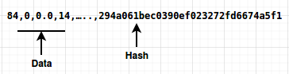

# **Task 1: AndMal2020-CDMC: Android Malware Detection**

The unrivalled threat of Android malware is the root cause of various security problems. Despite of tremendous research work, it is still menacing the cyber world. AndMal2020 is the collection of huge android malware samples that contains 12 malware categories and 191 malware families. The part of dataset presented here has a shape (61831x2497). The purpose of this dataset is to help evaluate models to early detect and characterize android malware. It is divided into training (51%) and testing set (49%) with following shape.

## **Dataset Shape**

The training set is labelled and contains malware family, malware category and malware labels as last three columns. However, testing set is not labelled. That is why the number of columns vary in dataset for testing and training set as mentioned above.

Following table quantifies the testing and training set for each malware category.

<table>
    <tr>
        <td rowspan="2">Malware Category</td>
        <td colspan="2">Number of Samples</td>
    </tr>
    <tr>
        <td>Testing Set</td>
        <td>Training Set</td>
    </tr>
    <tr>
        <td>Riskware</td>
        <td>17013</td>
        <td>16977</td>
    </tr>
    <tr>
        <td>Adware</td>
        <td>8258</td>
        <td>8134</td>
    </tr>
    <tr>
        <td>Ransomware</td>
        <td>805</td>
        <td>1093</td>
    </tr>
    <tr>
        <td>Banker</td>
        <td>122</td>
        <td>157</td>
    </tr>
    <tr>
        <td>propper</td>
        <td>318</td>
        <td>412</td>
    </tr>
    <tr>
        <td>Spyware</td>
        <td>469</td>
        <td>617</td>
    </tr>
    <tr>
        <td>Trojan</td>
        <td>2307</td>
        <td>2398</td>
    </tr>
    <tr>
        <td>SMS</td>
        <td>399</td>
        <td>542</td>
    </tr>
    <tr>
        <td>Scareware</td>
        <td>203</td>
        <td>287</td>
    </tr>
    <tr>
        <td>PUA</td>
        <td>260</td>
        <td>373</td>
    </tr>
    <tr>
        <td>Backdoor</td>
        <td>192</td>
        <td>287</td>
    </tr>
    <tr>
        <td>Filelnfector</td>
        <td>81</td>
        <td>127</td>
    </tr>
    <tr>
        <td>Total Samples</td>
        <td>30427</td>
        <td>31404</td>
    </tr>
</table>

Note that:

- The captured malware data is a matrix of strings, integers, and float numbers. The hash of every sample in testing set is presented in last column whereas the hash of every samples in training set is presented in fourth last column.

- The data is stored in “.csv” file, which can be read as a pure text file. The file name represents the training and testing data.

- The data structure of the training file is given as:

  

- The data structure of the testing file is given as:

  